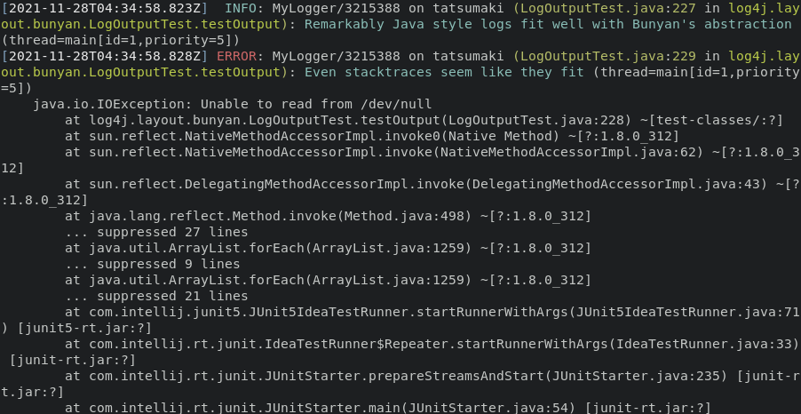

[](https://github.com/dekobon/bunyan-view/actions/workflows/ci.yaml)   

# Bunyan Viewer



This project is a rewrite of the [node-bunyan](https://github.com/trentm/node-bunyan/) bunyan format 
[log viewer CLI tool](https://github.com/trentm/node-bunyan/blob/master/bin/bunyan) fully reimplemented in Rust.

Bunyan Viewer aims to be a stand-alone replacement for the node bunyan tool such that it:
 * Does not require additional runtimes (such as nodejs)
 * Can handle large log files with ease
 * Processes each log line in a memory efficient manner

## Divergences

We aim to provide output that is as close as possible to the [node-bunyan](https://github.com/trentm/node-bunyan/)
viewer with a few intentional [divergences](DIVERGENCES.md).

## Features

Bunyan Viewer supports the following features:
 * The same output modes as the node-bunyan viewer (`-o, --output` flag):
   - `bunyan`: 0 indented JSON, bunyan's native format
   - `inspect`: node.js `util.inspect` output
   - `json`: JSON output, 2-space indent
   - `json-N`: JSON output, N-space indent, e.g. "json-4"
   - `long`: (the default) pretty
   - `short`: like "long", but more concise
   - `simple`: level, followed by "-" and then the message`
 * Local time conversion (`-L, --time-local` flage)
 * Filtering by level (`-l, --level` flag)
 * Strict mode (`--strict` flag)
 * Optional colorization - with a few extra colors sprinkled in (`--color` flag)
 * Pager support (`--pager` flag)
 * Decompression of [gzipped](https://www.gnu.org/software/gzip/) archives
 * Node bunyan CLI compatibility
 * Supports viewing large log files

## Limitations

Bunyan Viewer does not yet support the following:
 * Runtime log snooping via DTrace (`-p` flag)
 * Conditional filtering (`-c, --condition` flag)

## Installation

Install the Bunyan Viewer into your [Cargo Crates](https://crates.io/) enabled environment by:
```
  cargo install bunyan_view
```

## Usage

Directly viewing one or more bunyan log files:
```
  bunyan logs/logs-001.log logs/logs-002.log logs/big-log-003.log.gz
```
View logs via piped input:
```
  cat logs/logs-001.log | bunyan 
```
Alternatively:
```
  bunyan < logs/logs-001.log
```
For additional usage help:
```
  bunyan --help
```

## Testing

When running the automated testing suite, be sure to enable the `dumb_terminal` feature so that colorization is 
disabled. You can do this by invoking `cargo test` as follows:
```
  cargo test --features dumb_terminal
```

## Other Bunyan Projects

 * [node-bunyan](https://github.com/trentm/node-bunyan/) - The original that inspired this project
 * [bunyan-rs](https://github.com/LukeMathWalker/bunyan) - Another rust port of bunyan
 * [log4j2-bunyan-layout](https://github.com/dekobon/log4j2-bunyan-layout) - Bunyan Layout for Log4j2

## License
This project is licensed under the Mozilla Public License Version 2.0. See the [LICENSE.txt](LICENSE.txt)
file for more details.